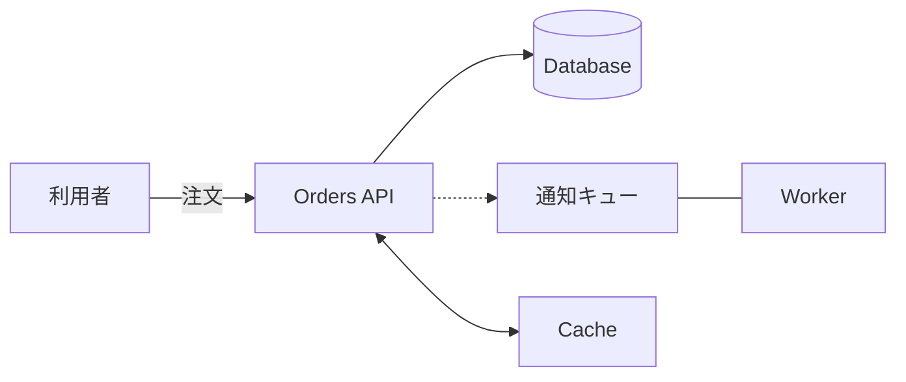
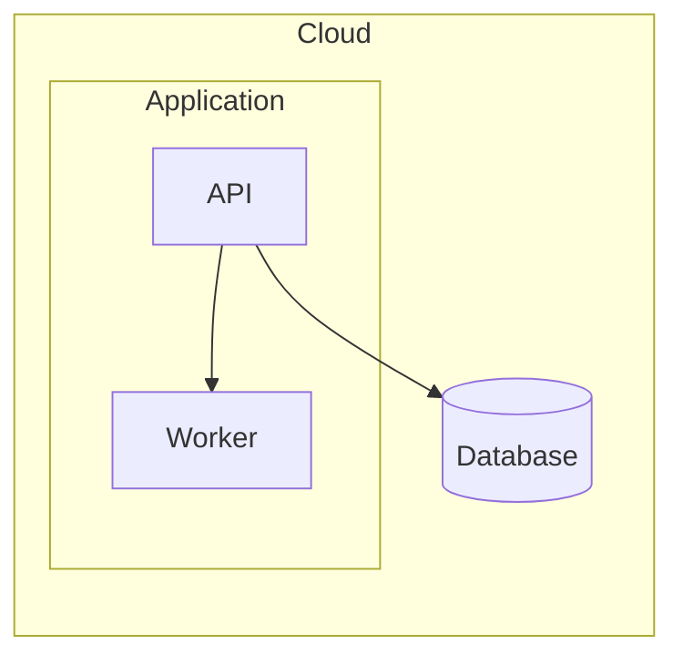
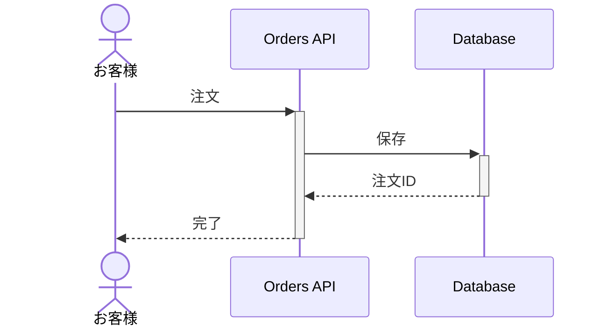
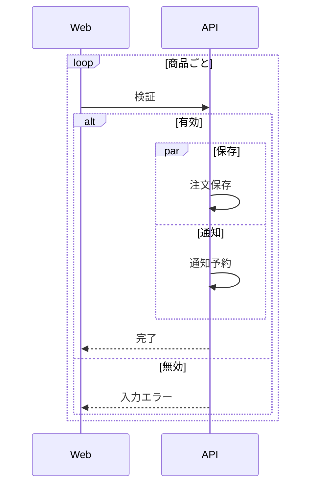
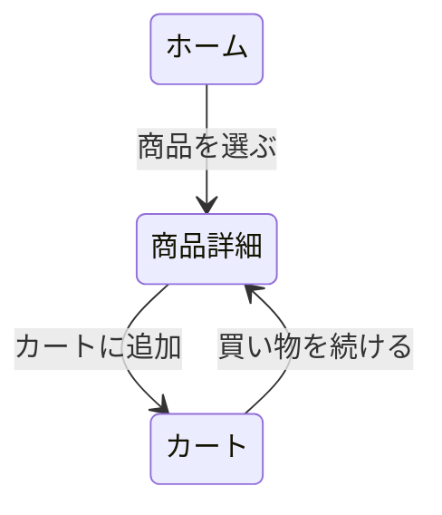
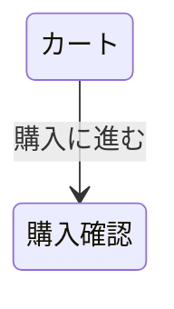
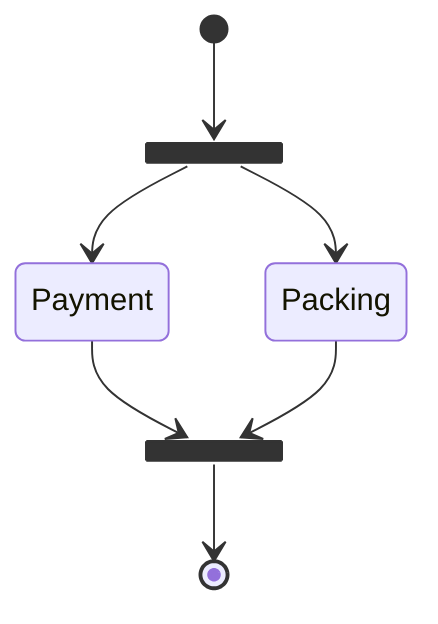
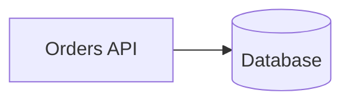
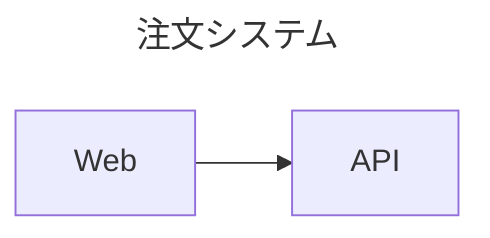

# Mermaid記法と対応範囲

ArchMap Mermaid は、公式 Mermaid 12.0.0 のパーサーで解析し、独自のグリッド配置・直交配線・SVGで描画します。Mermaid標準レンダラーと同じ見た目を再現する製品ではありません。対応する構文は以下の範囲です。

## 図の選び方

| 用途 | Mermaidの宣言 | 補助設定の view |
| --- | --- | --- |
| システム構成図 | `flowchart LR` | `system`（既定） |
| レイヤースタック図 | `flowchart TB` | `layers` |
| シーケンス図 | `sequenceDiagram` | 不要 |
| 画面遷移図 | `stateDiagram-v2` または `flowchart LR` | `screens`（状態図では既定） |
| アクティビティ図 | `stateDiagram-v2` または `flowchart TB` | `activity` |

図の基本情報・接続はMermaid標準記法で書きます。`%% archmap:` は任意の表示設定で、他のMermaidツールでは通常のコメントとして無視されます。モーダル・画面内操作・配置指定はArchMap Mermaid固有の表示です。

## フローチャート

`graph` も利用できます。方向は `LR`、`TB`、`TD`。四角形・角丸・円・スタジアム・二重円・データベース・ひし形に対応します。ArchMapのカード、開始・終了、データベース、分岐の形へ対応付けます。ノードの暗黙宣言、ラベル付き接続、自己接続、複数接続、実線・破線・双方向・矢印なしの線を利用できます。

`A@{ icon: "aws:lambda", label: "Lambda" }` のアイコン属性にも対応します。キーの `aws:` / `gcp:` / `azure:` は内部で `/` に変換します。組み込まれていないアイコンや外部画像はエラーになります。サービス名の別名はアイコン一覧で確認してください。

## グループと入れ子

`subgraph` は入れ子にできます。状態図では `state NAME { ... }` がグループになります。グループそのものへの接続は未対応です。グループ内の具体的なノードに接続してください。グループ個別の方向は警告を出し、図全体の方向を使用します。

## シーケンスと活性区間

`participant`、`actor`、`as`、`activate`、`deactivate`、メッセージの `+` / `-` に対応します。参加者はコンパクトに表示し、ラベルは送信元側に寄せます。

矢印は `->>` / `-->>`（塗りつぶし）、`->` / `-->`（矢印なし）、`-)` / `--)`（開いた矢印）、`<<->>` / `<<-->>`（双方向）に対応します。実線・破線を維持します。`autonumber` と開始番号・増分にも対応します。

## 分岐・繰り返し・並列

`alt` / `else`、`opt`、`loop`、`par` / `and`、`end` を利用でき、相互に入れ子にできます。活性区間は開始と終了を対応させてください。

## 画面遷移

各画面の出力接続をアクション行として表示し、行から線を引きます。複数の遷移もリストに並びます。モーダル・状態変更・遷移しない操作は以下の補助設定で表現できます。

画面間の遷移は必ずMermaidの矢印で記述します。補助設定の actions に遷移先は書きません。`state`、`effect`、`close` は排他的です。`when` に表示上の条件を追加できます。`close: true` はモーダルだけで使用できます。操作名の `label` と所有画面の `node` は必須です。

## アクティビティと並列分岐

判断ノードに表示名を付ける場合は、`state stock <<choice>>` と `stock : 在庫あり？` を別々の行に書きます。`state "在庫あり？" as stock <<choice>>` と1行にまとめると別IDとして解析されるため使用できません。

開始・終了は `[*]`、判断は `<<choice>>`、並列開始・合流は `<<fork>>` / `<<join>>` を使用します。状態図の複合状態はグループに変換します。同時状態の `--` 区切りは未対応です。

## 任意の表示設定

1文書に1行の `%% archmap: JSON` を書けます。改行を含む複数行のJSONは未対応です。設定を省略しても標準Mermaidだけで描画できます。

| キー | 値と意味 |
| --- | --- |
| `view` | `system` / `layers` / `screens` / `activity`。シーケンスは宣言から判定 |
| `style` | `cards`（既定）/ `icons`。アイコン主体表示は system / layers 用 |
| `nodes.ID.icon` | 組み込みアイコン一覧のキー |
| `nodes.ID.description` | 説明の文字列 |
| `nodes.ID.color` | `blue` / `green` / `orange` / `purple` / `gray` |
| `nodes.ID.at` | `[列,行]`。整数1〜400。同じセルの重複不可 |
| `nodes.ID.shape` | `modal`。screensだけで利用可能 |
| `actions` | 画面内操作の配列。上記の画面遷移節を参照 |

グリッドは相対的な順序を指定します。空の行・列は詰めて表示します。シーケンスの参加者順は宣言順、レイヤーはグループの順で決まり、これらでは at は使用しません。

タイトルは標準のfrontmatterを使います。

## 未対応と互換性

この版はMermaid完全互換ではありません。`architecture-beta`、ER、クラス図などの他の図種、RL / BT方向、グループへの接続、シーケンスの Note / box / create / destroy / critical / break / rect / クロス矢印、状態図のnote・同時状態、外部画像、click、init、frontmatterのconfigはエラーになります。

MermaidのCSS装飾・クラス・接続アニメーション・個別グループの方向は警告を表示し、ArchMapの表示に統一します。Markdownラベルの装飾は文字列として表示します。HTMLラベルを実行せず、外部アイコンを取得しません。構文上正しくても、この対応範囲にない機能は利用できません。

公式仕様: [Flowchart](https://mermaid.js.org/syntax/flowchart.html)、[Sequence](https://mermaid.js.org/syntax/sequenceDiagram.html)、[State](https://mermaid.js.org/syntax/stateDiagram.html)。同じ .mmd を他のMermaid環境でも開けますが、補助設定と描画結果は引き継がれません。

## 上限と性能

400ノード、200グループ、1,000接続、1,000画面内操作、グループ8段、フラグメント1,000文・8段、活性区間2,000文・16段、ソース500,000文字までです。文字数はUTF-16コード単位です。線が密な図は処理時間と交差が増えるため、必要に応じてグリッドを調整してください。入力はブラウザー内で解析し、サーバーには送信しません。

## 保存とオフライン利用

エディタの折りたたみ、マウスドラッグによる移動、ホイールズーム、Fit、SVG / PNG / .mmd保存に対応します。下書きはこのブラウザーに保存します。

オフライン版は、パーサー・レンダラー・アイコン・構文リファレンス・AIプロンプトを含む単一HTMLです。ダウンロード後はネット接続なしで開けます。アイコン一覧も全件をUTF-8テキストで保存できます。
