# Mermaid記法と対応範囲

ArchMap Mermaid は、公式 Mermaid 12.0.0 のパーサーで解析し、独自のグリッド配置・直交配線・SVGで描画します。Mermaid標準レンダラーと同じ見た目を再現する製品ではありません。対応する構文は以下の範囲です。

## 対応表

○は、表に示す標準構文をArchMapのレンダラーで描画できること、×は未対応を表します。MermaidのCSSや外観をそのまま再現するという意味ではありません。

| 図種 | 対応 | 確認した範囲 |
| --- | --- | --- |
| Flowchart / Graph | ○ | 標準形状・画像、全方向、入れ子subgraphと内部方向、グループへの接続、各端点、不可視線 |
| Sequence | ○ | メッセージ・半矢印・中央接続、参加者タイプ・生成/破棄・リンク、Note、box、活性区間、各フレーム |
| State / Activity | ○ | 複合状態と内部方向、Note、同時状態、開始/終了、choice/fork/join |
| ER | ○ | 属性・キー・型・コメント、別名、多重度、識別/非識別、自己関連 |
| Use Case | ○ | Actor・Use Case、境界、関連・include/extend・汎化、Note |
| Class／クラス図 | × | — |
| Architecture／アーキテクチャ図 | × | `architecture-beta`。システム構成図はFlowchartで作成可能 |
| C4図 | × | — |
| Mindmap／マインドマップ | × | — |
| Block／ブロック図 | × | — |
| Requirement／要求図 | × | — |
| GitGraph | × | — |
| Gantt／ガントチャート | × | — |
| Timeline／タイムライン | × | — |
| User Journey | × | — |
| Kanban／カンバン | × | — |
| Pie／円グラフ | × | — |
| Quadrant／四象限図 | × | — |
| XY Chart | × | — |
| Sankey／サンキー図 | × | — |
| Packet／パケット図 | × | — |
| Radar／レーダーチャート | × | — |
| Treemap／ツリーマップ | × | — |
| ZenUML | × | — |

画面遷移・アクティビティ・レイヤー表示はFlowchart／Stateを使ったArchMapのビューです。詳しい対応構文と表示上の制約は、以下の各節を参照してください。

## 図の選び方

| 用途 | Mermaidの宣言 | 補助設定の view |
| --- | --- | --- |
| ER図 | `erDiagram` | 不要 |
| ユースケース図 | `usecase-beta` | 不要 |
| システム構成図 | `flowchart LR` | `system`（既定） |
| レイヤースタック図 | `flowchart TB` | `layers` |
| シーケンス図 | `sequenceDiagram` | 不要 |
| 画面遷移図 | `stateDiagram-v2` または `flowchart LR` | `screens`（状態図では既定） |
| アクティビティ図 | `stateDiagram-v2` または `flowchart TB` | `activity` |

図の基本情報・接続はMermaid標準記法で書きます。`%% archmap:` は任意の表示設定で、他のMermaidツールでは通常のコメントとして無視されます。モーダル・画面内操作・配置指定はArchMap Mermaid固有の表示です。

## フローチャート

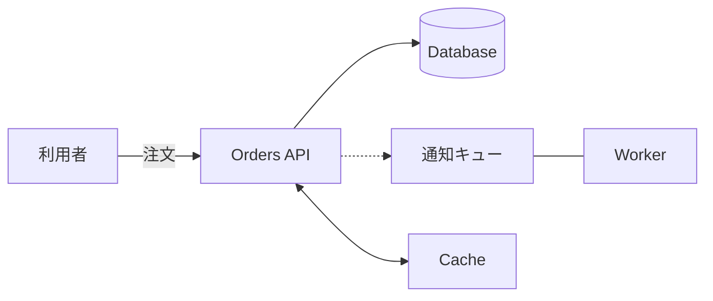
```mermaid
flowchart LR
  user[利用者] -->|注文| api[Orders API]
  api --> db[(Database)]
  api -.-> queue[通知キュー]
  api <--> cache[Cache]
  queue --- worker[Worker]
```

`graph` も利用できます。方向は `LR`、`RL`、`TB`、`TD`、`BT`。四角形・角丸・円・スタジアム・二重円・データベース・ひし形に加え、サブルーチン・六角形・平行四辺形・台形・文書・複数文書・遅延・三角形・クラウドなどの標準形状に対応します。`A@{ shape: doc, label: "仕様書" }` のような標準shape属性も使えます。形状の意味を保ち、色と書体はArchMapに統一します。ノードの暗黙宣言、ラベル付き接続、自己接続、複数接続、実線・破線・太線・双方向・矢印なし・円端点・クロス端点を利用できます。`~~~` は配置に使い、線を描きません。

`A@{ icon: "aws:lambda", label: "Lambda" }` のアイコン属性にも対応します。キーの `aws:` / `gcp:` / `azure:` は内部で `/` に変換します。組み込まれていないアイコンはエラーになります。画像は以下の標準img構文で指定します。サービス名の別名はアイコン一覧で確認してください。

## グループと入れ子

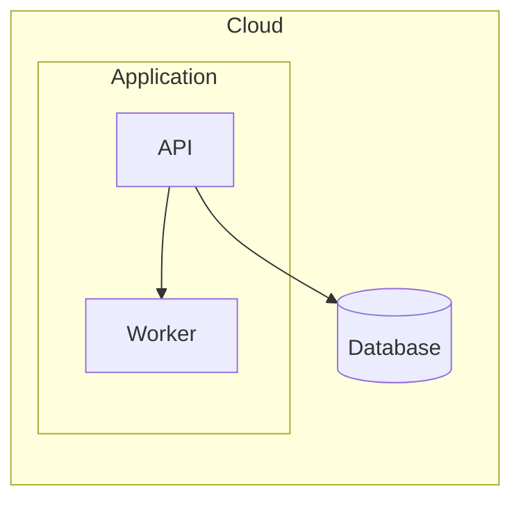
```mermaid
flowchart LR
  subgraph cloud[Cloud]
    subgraph app[Application]
      api[API] --> worker[Worker]
    end
    db[(Database)]
    api --> db
  end
```

`subgraph` は入れ子にできます。`Group@{ view: collapsed }` は内部を非表示にし、外部との線をグループ枠へ接続します。展開する場合は `view: expanded` を使います。状態図では `state NAME { ... }` がグループになります。グループIDへの接続はグループ枠に接続します（例: `Client --> cloud`、`cloud --> Storage`）。グループ間、入れ子のグループ、内部ノードとの接続にも対応します。グループ内の `direction LR / RL / TB / BT` に対応します。親と子で異なる方向を指定でき、グループを1つの配置単位として扱います。明示的な `at` がある場合は手動配置を優先し、警告を表示します。`layers` ビューでは層の配置を優先します。

## シーケンスと活性区間

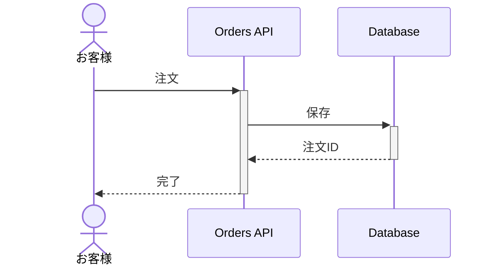
```mermaid
sequenceDiagram
  actor user as お客様
  participant api as Orders API
  participant db as Database
  user->>+api: 注文
  api->>+db: 保存
  db-->>-api: 注文ID
  api-->>user: 完了
  deactivate api
```

`participant`、`actor`、`as`、`participant A@{ "type": "boundary" }` などの標準タイプ属性（boundary/control/entity/database/collections/queue）、`activate`、`deactivate`、メッセージの `+` / `-` に対応します。参加者はコンパクトに表示し、ラベルは送信元側に寄せます。

矢印は `->>` / `-->>`（塗りつぶし）、`->` / `-->`（矢印なし）、`-)` / `--)`（開いた矢印）、`<<->>` / `<<-->>`（双方向）に対応します。`-x` / `--x`（クロス端点）にも対応し、実線・破線を維持します。`autonumber` と開始番号・増分にも対応します。

半矢印（上下・逆方向・実線／破線）と中央ライフライン接続 `()` にも対応します。中央接続と活性区間は別の指定で、中央接続だけなら `deactivate` は不要です。

```mermaid
sequenceDiagram
  participant API@{ "type": "boundary" }
  participant Worker@{ "type": "control" }
  link API: API資料 @ https://example.com/docs
  properties API: {"owner":"Platform"}
  API-|/Worker: 下半分の矢印
  API->>()Worker: 中央接続
```

`link` / `links` は参加者カード内にリンクとして表示し、`properties` は説明欄に表示します。HTTP(S)・メール・相対リンクを利用でき、実行可能なURLは省略して警告します。SVG保存後もリンクが残ります。ホストページ内の要素を読む `details` には依存せず、図の中へ `properties` / `links` を記述してください。

## 分岐・繰り返し・並列

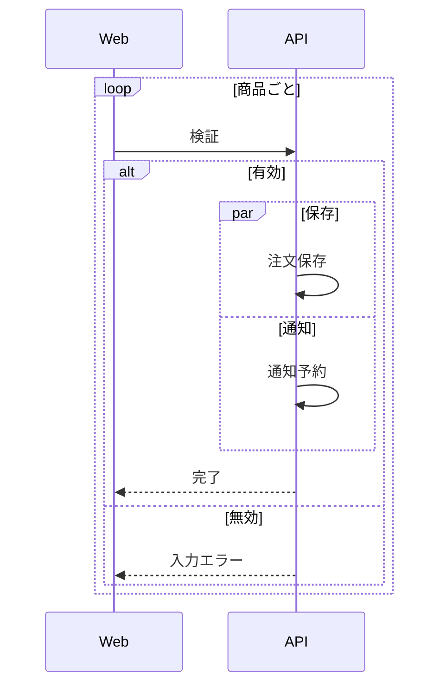
```mermaid
sequenceDiagram
  participant web as Web
  participant api as API
  loop 商品ごと
    web->>api: 検証
    alt 有効
      par 保存
        api->>api: 注文保存
      and 通知
        api->>api: 通知予約
      end
      api-->>web: 完了
    else 無効
      api-->>web: 入力エラー
    end
  end
```

`alt` / `else`、`opt`、`loop`、`par` / `and`、`critical` / `option`、`break`、`rect`、`end` を利用でき、相互に入れ子にできます。`rect` は背景をハイライトします。活性区間は開始と終了を対応させてください。

`Note left of A`、`Note right of A`、`Note over A,B` は対象ライフラインに合わせ、前後のメッセージと重ならない位置に配置します。改行は ` ` を使います。`box` は参加者を囲みます。`create participant` / `create actor` は生成メッセージの高さに参加者を置き、`destroy` は破棄時点に×印を付けライフラインを終了します。

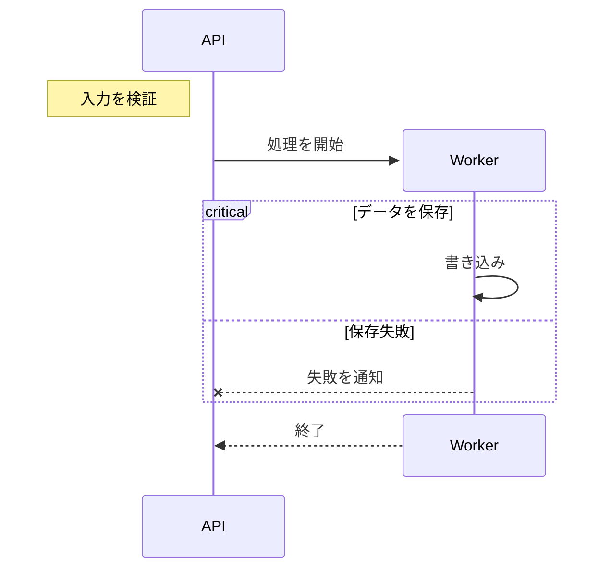
```mermaid
sequenceDiagram
  participant API
  Note left of API: 入力を検証
  create participant Worker
  API->>Worker: 処理を開始
  critical データを保存
    Worker->>Worker: 書き込み
  option 保存失敗
    Worker--xAPI: 失敗を通知
  end
  destroy Worker
  Worker-->>API: 終了
```

## 画面遷移

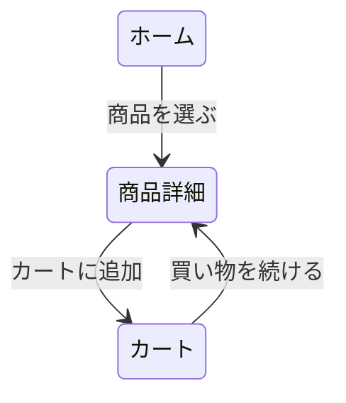
```mermaid
stateDiagram-v2
  state "ホーム" as home
  state "商品詳細" as detail
  state "カート" as cart
  home --> detail: 商品を選ぶ
  detail --> cart: カートに追加
  cart --> detail: 買い物を続ける
```

各画面の出力接続をアクション行として表示し、行から線を引きます。複数の遷移もリストに並びます。モーダル・状態変更・遷移しない操作は以下の補助設定で表現できます。

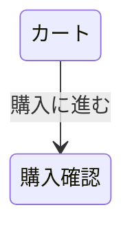
```mermaid
%% archmap: {"view":"screens","nodes":{"confirm":{"shape":"modal"}},"actions":[{"node":"cart","label":"クーポン適用","effect":"合計を再計算"},{"node":"cart","label":"数量変更","state":"変更済み"},{"node":"confirm","label":"閉じる","close":true}]}
stateDiagram-v2
  state "カート" as cart
  state "購入確認" as confirm
  cart --> confirm: 購入に進む
```

画面間の遷移は必ずMermaidの矢印で記述します。補助設定の actions に遷移先は書きません。`state`、`effect`、`close` は排他的です。`when` に表示上の条件を追加できます。`close: true` はモーダルだけで使用できます。操作名の `label` と所有画面の `node` は必須です。

## 画像付きノード・画面遷移

標準Mermaidの `img` 属性に対応します。独自の画像構文は不要です。通常のflowchartでも利用でき、画面遷移ビューでは画像と操作一覧を1枚のカードに表示します。

```mermaid
flowchart LR
  home@{ img: "https://example.com/home.png", label: "ホーム", pos: "t", h: 240, constraint: "on" }
  detail@{ img: "https://example.com/detail.png", label: "商品詳細", pos: "t", h: 240, constraint: "on" }
  home -->|商品を選ぶ| detail
```

既存の画面遷移表示を使う場合は `%% archmap: {"view":"screens"}` を先頭に指定します。画像の指定そのものは標準構文です。`stateDiagram-v2` に画像構文を追加するものではありません。

`w` / `h` は幅・高さ、`pos` はラベル位置（t=上、b=下）、`constraint: "on"` は元画像の比率を保って高さから幅を求めます。offでは幅と高さを独立に扱います。未指定寸法には読み込んだ画像の寸法を使います。

PNG / JPEG / WebP / GIF / SVGのURLや画像data URLを読み込み、静止画像としてSVGに埋め込みます。これにより書き出したSVG・PNGに画像が残ります。アニメーションは保持しません。外部URLには画像配信元のCORS許可が必要です。読込失敗時は警告と代替枠を表示します。画像URLを使うと画像配信元への通信が発生します。オフラインで使う場合はdata URLを使ってください。

ブラウザーAPIの `renderMermaid` は画像読込と埋め込みまで行います。低レベルの同期 `renderDiagram` を直接使う場合は、先に `await prepareDiagramImages(model)` を呼んでください。

## アクティビティと並列分岐

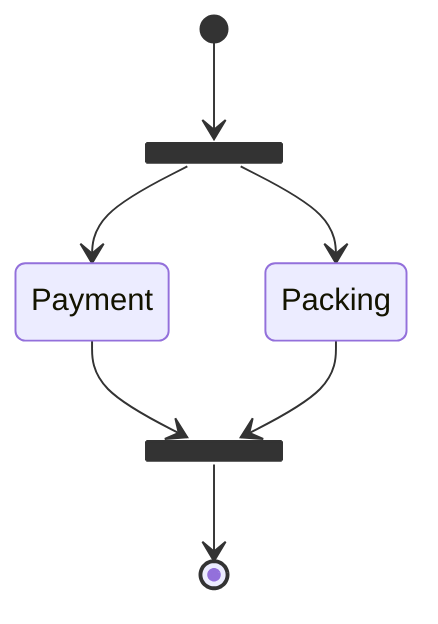
```mermaid
%% archmap: {"view":"activity"}
stateDiagram-v2
  state split <<fork>>
  state merge <<join>>
  [*] --> split
  split --> Payment
  split --> Packing
  Payment --> merge
  Packing --> merge
  merge --> [*]
```

判断ノードに表示名を付ける場合は、`state stock <<choice>>` と `stock : 在庫あり？` を別々の行に書きます。`state "在庫あり？" as stock <<choice>>` と1行にまとめると別IDとして解析されるため使用できません。

開始・終了は `[*]`、判断は `<<choice>>`、並列開始・合流は `<<fork>>` / `<<join>>` を使用します。状態図の複合状態はグループに変換し、内部の `direction` も反映します。同時状態の `--` 区切りは、複合状態内の独立した並行領域として表示します。`note left of STATE: 注記` / `note right of STATE: 注記` と複数行の `note ... end note` に対応し、注記を画面のアクションには含めません。

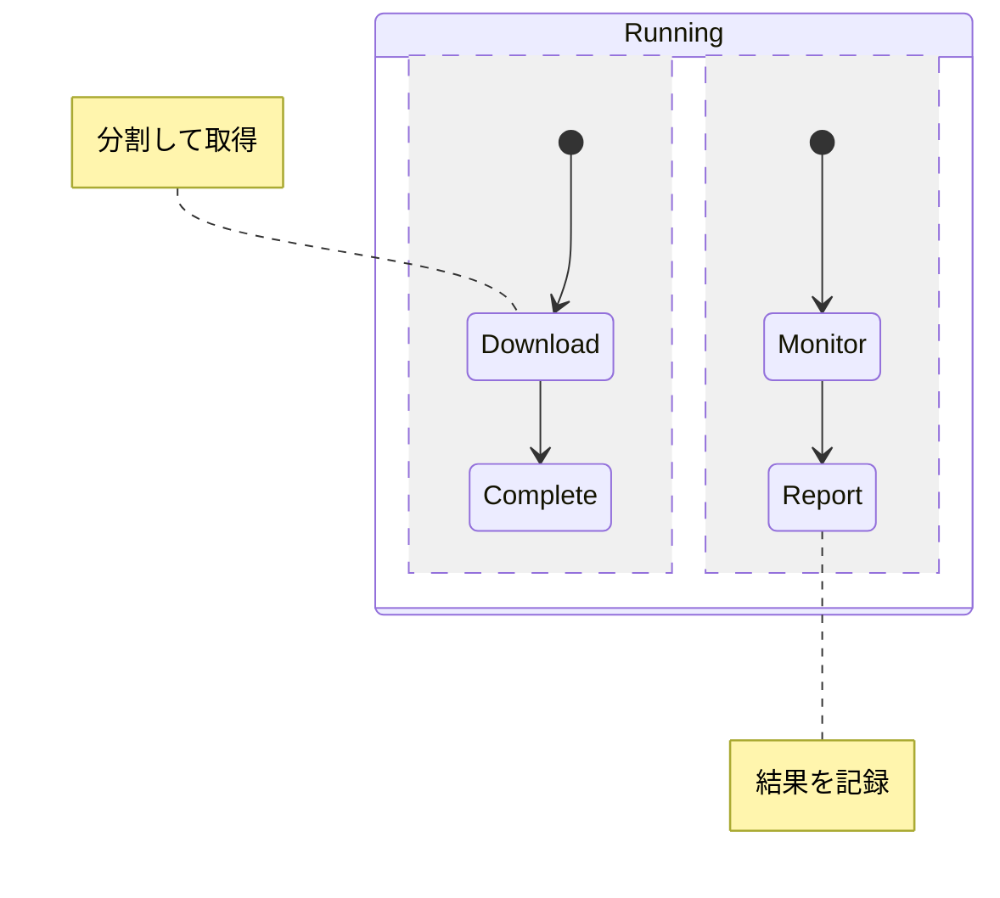
```mermaid
stateDiagram-v2
  state Running {
    [*] --> Download
    Download --> Complete
    --
    [*] --> Monitor
    Monitor --> Report
  }
  note left of Download: 分割して取得
  note right of Report: 結果を記録
```

## ER図

`erDiagram` を使います。エンティティは属性表として描き、PK / FK / UK、属性名、型、コメントを分けて表示します。長い属性名・型・コメントは折り返します。属性なしのエンティティ、表示名の別名、nullable型にも対応します。

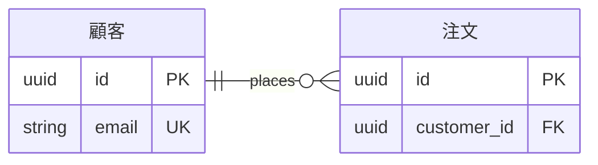
```mermaid
erDiagram
  direction LR
  CUSTOMER[顧客] {
    uuid id PK
    string email UK
  }
  ORDER[注文] {
    uuid id PK
    uuid customer_id FK
  }
  CUSTOMER ||--o{ ORDER : places
```

関係の両端にカラスの足記法を表示します。`||`（1）、`o|`（0または1）、`|{`（1以上）、`o{`（0以上）を区別し、識別関係は実線、非識別関係は破線です。線はエンティティへの関係であり、特定の属性への接続を推測しません。`nodes` の補助設定には元のエンティティ名を使います。

## ユースケース図

Mermaid 12の `usecase-beta` を使います。アクターはアイコン付きカード、ユースケースは角丸カプセルまたは矩形、システム境界は淡い背景の枠です。アクターを関連する操作の近くに、include / extend先を別列に配置します。

```mermaid
usecase-beta
  direction LR
  actor Customer(顧客)
  systemBoundary Shop[注文サービス]
    Place(注文する)
    Pay(支払う)
    Coupon(クーポンを適用する)
  end
  Customer -- Place
  Place ..> : include Pay
  Coupon ..> : extend Place
```

関連、向き付き関連、include、extend、汎化（`Admin --|> User`）を区別します。include / extendは破線とラベル、汎化は白抜き三角です。宣言の前方参照、ステレオタイプ、円・クロス端点にも対応します。package境界やアクターの装飾種類はArchMap表示に統一し警告します。注記は `note for Pay "決済完了後に注文を確定"` と書きます。対象に破線で接続した折り返し可能な付箋として表示します。JSONノード、business指定は未対応としてエラーにします。

空のシステム境界も表示します。手動配置と自動配置で境界が重なる場合は、内部の相対位置を保って境界全体をずらします。

ER・ユースケースとも方向はLR / RL / TB / TD / BTです。任意のMermaid装飾や完全互換を保証するものではありません。

## 任意の表示設定

1文書に1行の `%% archmap: JSON` を書けます。改行を含む複数行のJSONは未対応です。設定を省略しても標準Mermaidだけで描画できます。

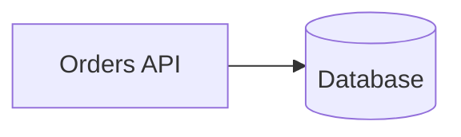
```mermaid
%% archmap: {"view":"system","style":"icons","nodes":{"api":{"icon":"gcp/cloud_run","description":"注文を受け付ける","color":"blue","at":[1,1]},"db":{"icon":"database","color":"green","at":[2,1]}}}
flowchart LR
  api[Orders API] --> db[(Database)]
```

| キー | 値と意味 |
| --- | --- |
| `view` | `system` / `layers` / `screens` / `activity` / `er` / `usecase`。シーケンスは宣言から判定 |
| `style` | `cards`（既定）/ `icons`。アイコン主体表示は system / layers 用 |
| `nodes.ID.icon` | 組み込みアイコン一覧のキー |
| `nodes.ID.description` | 説明の文字列 |
| `nodes.ID.color` | `blue` / `green` / `orange` / `purple` / `gray` |
| `nodes.ID.at` | `[列,行]`。整数1〜400。同じセルの重複不可 |
| `nodes.ID.shape` | `modal`。screensだけで利用可能 |
| `actions` | 画面内操作の配列。上記の画面遷移節を参照 |

グリッドは相対的な順序を指定します。空の行・列は詰めて表示します。シーケンスの参加者順は宣言順、レイヤーはグループの順で決まり、これらでは at は使用しません。

タイトルは標準のfrontmatterを使います。

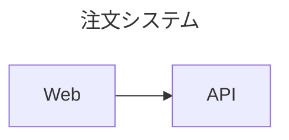
```mermaid
---
title: 注文システム
---
flowchart LR
  A[Web] --> B[API]
```

## 未対応と互換性

この版はMermaid完全互換ではありません。`architecture-beta`、クラス図などの他の図種、clickコールバックなどの実行コードは対象外です。`click`操作は現時点ではエラーになります。

`init` / frontmatterの `config` は読み込めます。`sequence.showSequenceNumbers` を反映し、その他のテーマ・レイアウト設定、CSS装飾・クラス・接続アニメーションは警告を表示して、ArchMapの表示に統一します。Markdownラベルの装飾は文字列として表示します。HTMLラベルを実行せず、外部アイコンを取得しません。構文上正しくても、この対応範囲にない機能は利用できません。

公式仕様: [Flowchart](https://mermaid.js.org/syntax/flowchart.html)、[Sequence](https://mermaid.js.org/syntax/sequenceDiagram.html)、[State](https://mermaid.js.org/syntax/stateDiagram.html)。同じ .mmd を他のMermaid環境でも開けますが、補助設定と描画結果は引き継がれません。

## 上限と性能

400ノード、200グループ、1,000接続、1,000画面内操作、グループ8段、フラグメント1,000文・8段、活性区間2,000文・16段、ソース500,000文字までです。文字数はUTF-16コード単位です。線が密な図は処理時間と交差が増えるため、必要に応じてグリッドを調整してください。入力はブラウザー内で解析し、サーバーには送信しません。

## 保存とオフライン利用

エディタの折りたたみ、スワイプ・マウスドラッグによる移動、2本指ピンチ・ホイールズーム、Fit、SVG / PNG / .mmd保存に対応します。下書きはこのブラウザーに保存します。

オフライン版は、パーサー・レンダラー・アイコン・構文リファレンス・AIプロンプトを含む単一HTMLです。ダウンロード後はネット接続なしで開けます。アイコン一覧も全件をUTF-8テキストで保存できます。
